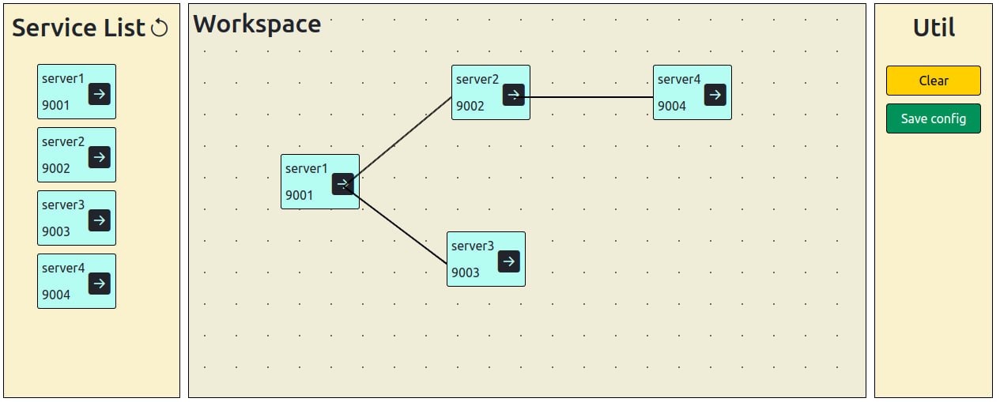

# ESB model

Данный репозиторий содержит модель сервисной шины предприятия, написанную в рамках дипломной работы.

## Запуск
`./redeploy.sh` - запуск системы  
`./client/restart_clients.sh` - генерация тестовых клиентов

Фронтенд будет развернут по адресу `localhost:3000`, эндпоинты бэкенда - `localhost:8000/docs#`. Тестовые клиенты - на портах из файла `restart_clients.sh`.

## Интерфейс
Интерфейс фронтенда состоит из списка подключенных к шине сервисов и рабочей поверхности, на которую их можно перемещать, а также проводить связи между ними. Нажитие на кнопку save_config сохраняет текущую конфигурацию отправки в бэкенд.  

## Эндпоинты бэкенда
* GET `/get_clients` - возвращает json вида `{"clients": [ ... ]}`, где вместо троеточия будет находиться список клиентов, подключенных к шине.
* POST `/save_config` - принимает массив строк конфига, сохраняет в бэк.
* POST `/connect` - принимает информацию о клиенте, подключает его к шине.
* POST `/send` - принимает сообщение от клиента, сохраняет его в шину